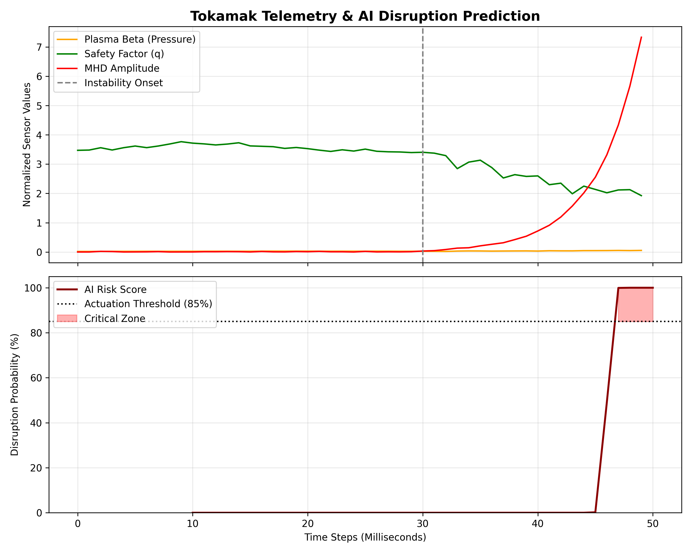
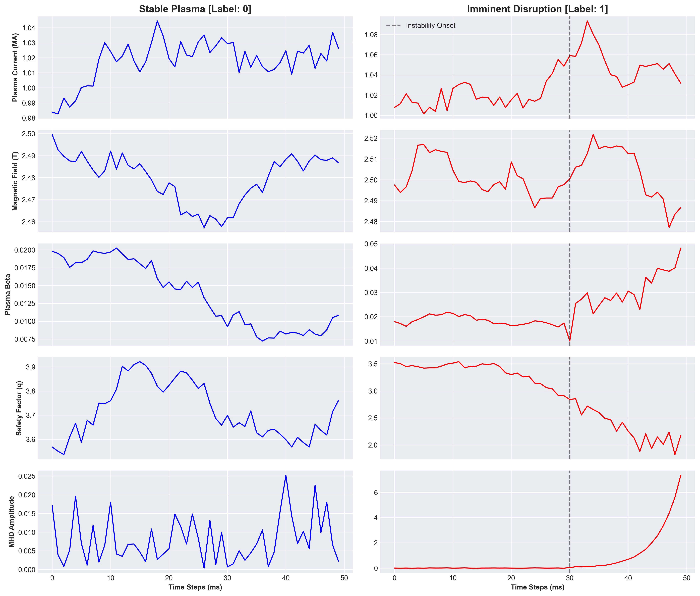

# Plasma Disruption Predictor (Synthetic Telemetry)
[](https://colab.research.google.com/github/sionaheritage/plasma-disruption-detector/blob/main/notebooks/colab_cloud_training.ipynb)

## Description
An end-to-end Machine Learning pipeline that predicts magnetic confinement disruptions in Tokamak fusion reactors. This project uses a Long Short-Term Memory (LSTM) neural network to analyse time-series telemetry and a heuristics engine to recommend real-time physical actuations. LSTMs enable consideration of the global dataset, whilst prioritising the most recent datapoints and remaining computationally efficient.

## Project Scope
This project initially spawned from a fusion hackathon idea. As such, the focus is on simulate a machine-learning pipeline to obtain usable results. In future, it could be extended to incorporate Tokamak data from an open source database, such as the Hugging Face TokaMark dataset. This would extend the project's time frame greatly and centre it on data engineering. In it's current state, developing it deepened my knowledge on physical concepts, datapoint generation, and deep-learning LSTMs in order to bring all of these points together.

Since raw experimental fusion data is often proprietary, this repository utilizes a custom **physics-informed synthetic data generator**. It simulates the complex temporal dynamics of a reactor, allowing the LSTM to learn the non-linear coupling of magnetic fields and pressure gradients without relying on terabytes of raw sensor data. Requires pyyaml>=6.0 to run.

## Results visual
Approximate results from the project.
Results generated graphically of estimated risk from evaluate.py:

Feature exploration of the synthetic plasma data from data_exploration.ipynb:


## Core Architecture
1. **Data Engineering (`data_generator.py`)**: Simulates 5 critical Tokamak diagnostics using random walks and exponential drift:
   - Plasma Current ($I_p$)
   - Toroidal Magnetic Field ($B_t$)
   - Plasma Beta ($\beta$) - *Pressure limits*
   - Safety Factor ($q$) - *Magnetic pitch*
   - MHD Amplitude - *Magnetic island fluctuations*
2. **Deep Learning (`lstm_model.py`)**: A multi-layer PyTorch LSTM designed for sequence-to-vector anomaly detection.
3. **Control Logic (`recommender.py`)**: An autonomous rule engine that parses AI risk probabilities and outputs physical mitigation strategies (e.g., NBI heating reduction, Massive Gas Injection).
4. **Configuration Management (`config.yaml`)**: Centralized hyperparameters for reproducible MLOps.

## Usage
```bash
# 1. Clone the repository
git clone [https://github.com/sionaheritage/plasma-disruption-detector.git](https://github.com/sionaheritage/plasma-disruption-detector.git)

# 2. Train the model (hyperparameters managed via config.yaml)
python src/train.py

# 3. Run the live inference monitor
python src/inference.py

# 4. Generate performance visualizations
python src/evaluate.py
```

## License
This project is licensed under the terms of the MIT license.